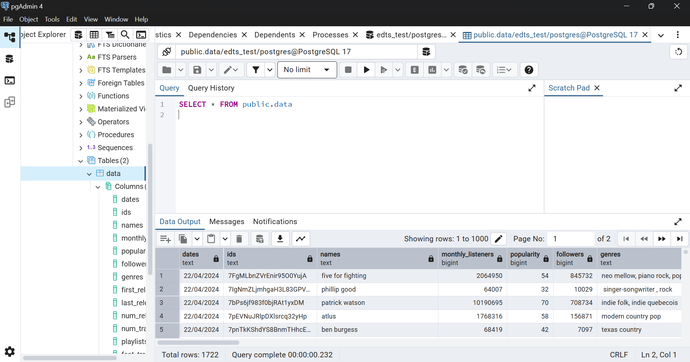
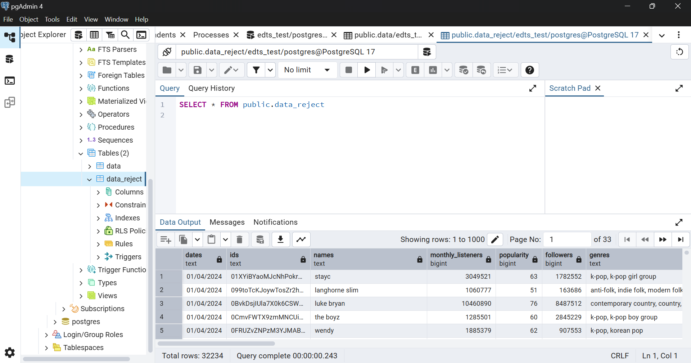

# CSV-Cleaner-with-Docker

## 📌 Description
This project processes a raw CSV file (`scrap.csv`) to:
- Remove duplicate records based on the `ids` column
- Store clean and duplicate data into PostgreSQL tables: `data` and `data_reject`
- Backup:
  - Clean data into a JSON file with a specified format
  - Duplicate data into a CSV file with the same format as the original

All outputs are saved to the `target/` folder with timestamps.

## How to Run

### 1. Install Dependencies
```bash
pip install --user pandas sqlalchemy psycopg
```

### 2. Update Database Credentials in `main.py`
Make sure to update this section with the PostgreSQL credentials:
```python
user = "postgres"
password = "password"
host = "localhost"
port = 5432
database = "edts_test"
```
> If running inside Docker, the script will automatically switch `host` to `host.docker.internal` using the `IN_DOCKER` environment variable.

### 3. Run the Script
```bash
python main.py
```

## 📁 Output Files
Located in the `/target` directory:
- `data_<timestamp>.json` → Cleaned data in JSON format
- `data_reject_<timestamp>.csv` → Duplicate records in CSV format

Example:
```
data_20250615153522.json
data_reject_20250615113522.csv
```

## Database Tables
- `data`: contains cleaned data (unique `ids`)
- `data_reject`: contains all rows with duplicate `ids`

> Both tables are automatically created by SQLAlchemy. We can refer to `ddl.sql` for the schema.

## 🧾 SQL DDL (in `ddl.sql`)
```sql
CREATE TABLE data (
    dates DATE,
    ids TEXT PRIMARY KEY,
    names TEXT,
    monthly_listeners INTEGER,
    popularity INTEGER,
    followers INTEGER,
    genres JSONB,
    first_release CHAR(4),
    last_release CHAR(4),
    num_releases INTEGER,
    num_tracks INTEGER,
    playlists_found TEXT,
    feat_track_ids JSONB
);

CREATE TABLE data_reject (
    dates DATE,
    ids TEXT,
    names TEXT,
    monthly_listeners INTEGER,
    popularity INTEGER,
    followers INTEGER,
    genres JSONB,
    first_release CHAR(4),
    last_release CHAR(4),
    num_releases INTEGER,
    num_tracks INTEGER,
    playlists_found TEXT,
    feat_track_ids JSONB
);
```

## ⚙️ Improvements
- Added error handling for parsing malformed JSON fields
- Used flexible timestamping for file versioning
- Applied safe JSON parsing to avoid crashing on invalid inputs

## Screenshot
screenshots of row counts from `data` and `data_reject` tables
- Screenshot of row counts from `data` tables

- Screenshot of row counts from `data_reject` tables


## Docker Instructions (Test 2)

### 1. Build and Run with Docker Compose
```bash
docker-compose up --build
```
This will:
- Build the Docker image
- Mount `source/` and `target/` directories into the container
- Execute `main.py` automatically

### 2. PostgreSQL Host Setting
- The script detects if it's running inside Docker using the `IN_DOCKER=1` environment variable
- If `IN_DOCKER=1`, it uses `host.docker.internal` to access the host PostgreSQL server
- Otherwise, it defaults to `localhost` when running locally

### 3. Stop and Remove Containers
```bash
docker-compose down
```
